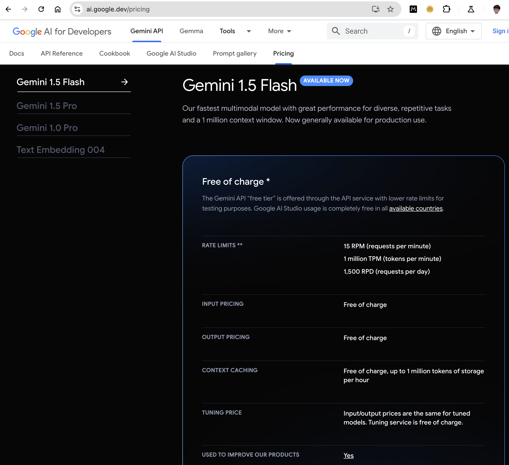
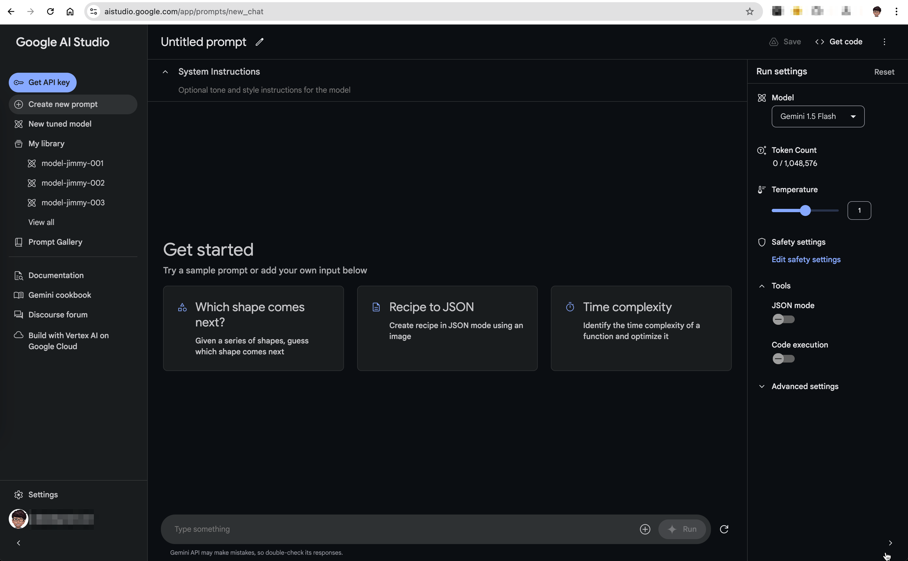

## ELI5 for Generative AI and Software Development
### ELI5 GenAI Day 04 - Gemini 1.5 Flash and AI Studio

身為一個價格敏感的開發者，看到這個 Pricing page 真是興奮。Gemini 1.5 Flash 的[計價方式](https://ai.google.dev/pricing)

通常在選擇與試驗模型時，可以有兩種方式:
- 使用 [AI Studio](https://aistudio.google.com/)
- 使用範例程式

這次先用 AI Studio 試驗看看，使用 Google 帳號登入 https://aistudio.google.com/

- 左邊選單
    - `Get API key`: 如果你是使用撰寫程式碼的方式，需要取得 API key
    - `Prompt`: 輸入你想要的文字, 以及 Prompt 管理

- 中間畫面
    - `System Instructions`: 顯示與模型互動時，需要回應的風格等等
    - 其他就是輸入文字與回應區

- 右邊選單
    - `Model`: 設定運行模型
    - `Token Count`: 總 Toekn 數量
    - `Temperature`: 溫度，控制回應的多樣性
    - `Safety`: 安全性，控制回應的合理性
    - `Tool`: 目前可以指定 `JSON Mode` 與 `Code Execution` 耶！

先來 `Create new prompt` 並點選 `Recipe to JSON` 這個範例看看吧！

看到右方會自動啟用 `JSON Mode`，這樣就可以直接看到回應的 JSON 格式了！

(但是其實以這個範例，沒打開 JSON Mode 好像也會產出 lol)

### 本篇同步發表於 [iThome](https://ithelp.ithome.com.tw/articles/10345970) 與 [個人電子報](https://memo.jimmyliao.net/) -> 訂閱訂起來

