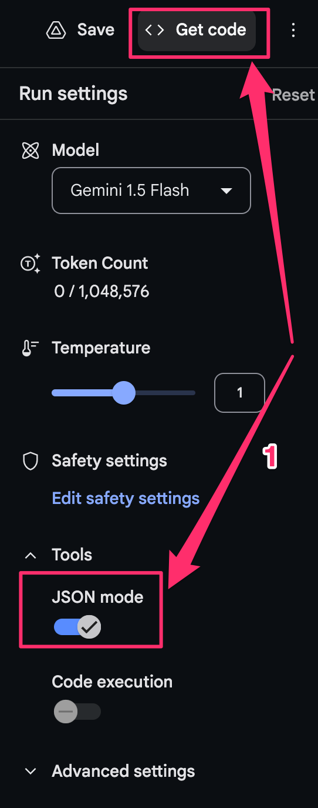
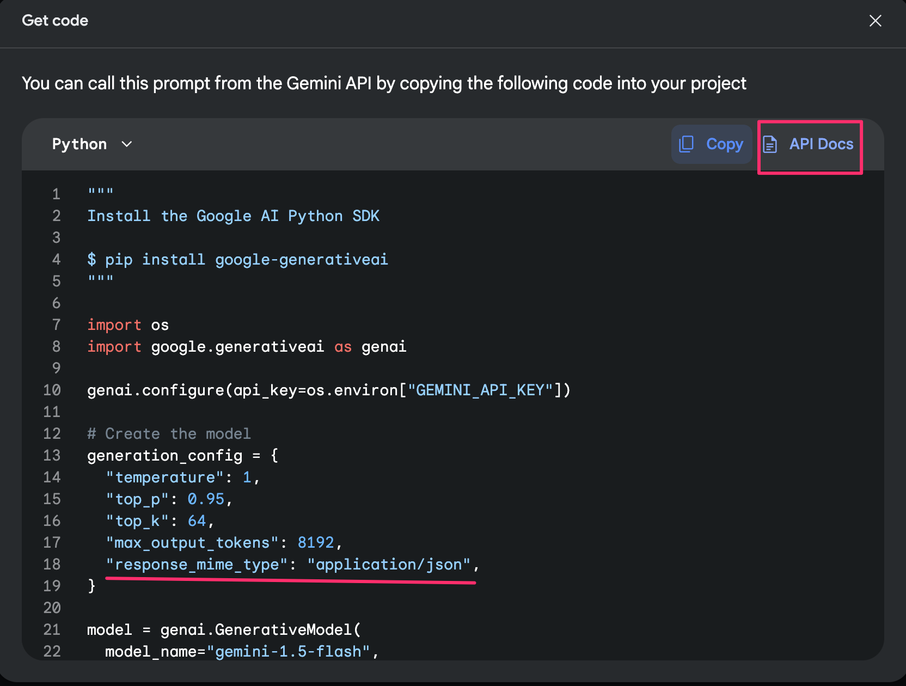
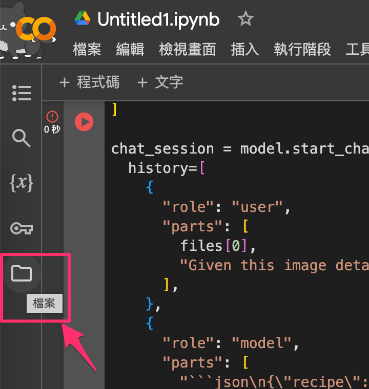
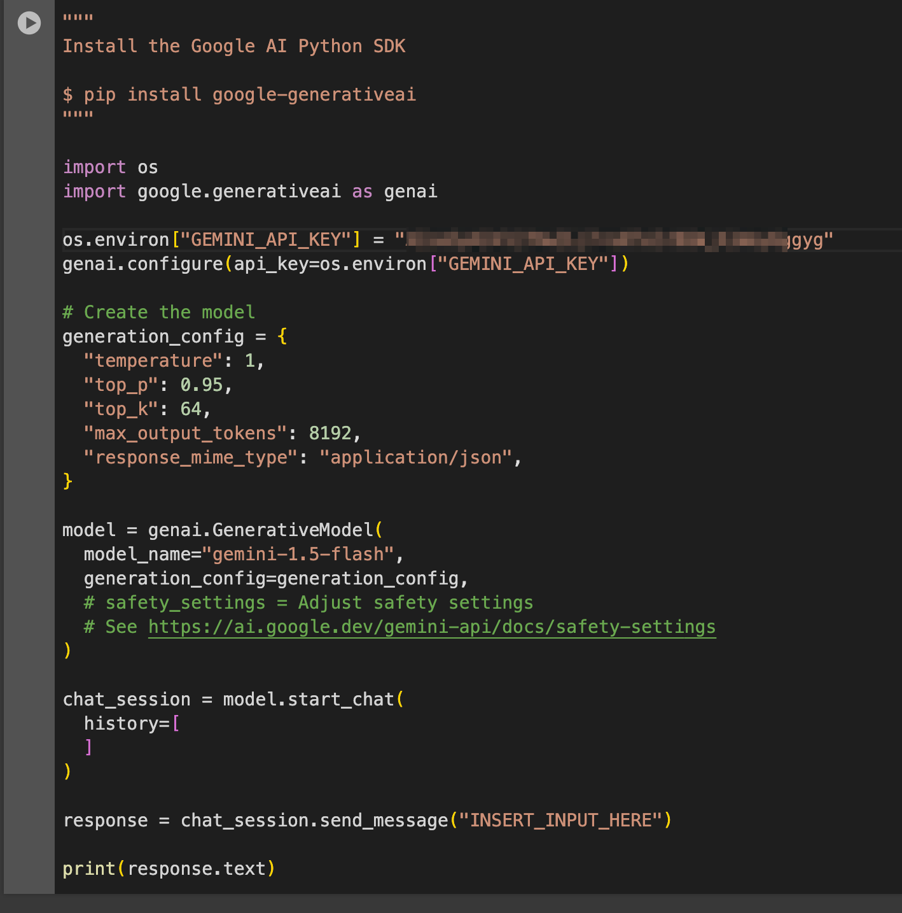

## ELI5 for Generative AI and Software Development
### ELI5 GenAI Day 05 - Gemini 1.5 Flash Multimodal API


1. 首先, 先產生 API Key


2. 這次使用 `Get Code`, 取得對應的程式碼





3. 打開 [Colab](https://colab.research.google.com/#create=true), 新增一個 Jupyter Notebook, 並貼上程式碼
4. 這次會使用 Multimodal API, 記得上傳圖片


5. 方便起見，將 API Key 設定好
```python
os.environ["GEMINI_API_KEY"] = "<YOUR_KEY>"
```



6. 完整程式碼如下
```python
"""
Install the Google AI Python SDK

$ pip install google-generativeai
"""

import os
import google.generativeai as genai

os.environ["GEMINI_API_KEY"] = "<YOUR_KEY>"

genai.configure(api_key=os.environ["GEMINI_API_KEY"])

def upload_to_gemini(path, mime_type=None):
  """Uploads the given file to Gemini.

  See https://ai.google.dev/gemini-api/docs/prompting_with_media
  """
  file = genai.upload_file(path, mime_type=mime_type)
  print(f"Uploaded file '{file.display_name}' as: {file.uri}")
  return file

# Create the model
generation_config = {
  "temperature": 1,
  "top_p": 0.95,
  "top_k": 64,
  "max_output_tokens": 8192,
  "response_mime_type": "application/json",
}

model = genai.GenerativeModel(
  model_name="gemini-1.5-flash",
  generation_config=generation_config,
  # safety_settings = Adjust safety settings
  # See https://ai.google.dev/gemini-api/docs/safety-settings
)

# TODO Make these files available on the local file system
# You may need to update the file paths
files = [
  upload_to_gemini("image_food4.jpeg", mime_type="image/jpeg"),
]

chat_session = model.start_chat(
  history=[
    {
      "role": "user",
      "parts": [
        files[0],
        "Given this image detail the recipe to bake this item in JSON format. Include item names and quantities for the recipe.",
      ],
    },
    {
      "role": "model",
      "parts": [
        "```json\n{\"recipe\": {\"title\": \"Roasted Potatoes with Chanterelles\", \"ingredients\": [\"1 pound baby potatoes\", \"1/2 cup chanterelle mushrooms\", \"2 tablespoons olive oil\", \"1/4 teaspoon salt\", \"1/4 teaspoon black pepper\", \"2 tablespoons chopped fresh parsley\"], \"instructions\": [\"Preheat oven to 400 degrees F (200 degrees C).\", \"Scrub the potatoes and cut them in half if they are large. \", \"Toss potatoes with olive oil, salt, and pepper.\", \"Spread potatoes in a single layer in a baking dish.\", \"Roast in preheated oven for 20 minutes, or until golden brown and tender.\", \"Add chanterelles to the baking dish and toss to coat in oil, salt, and pepper.\", \"Roast for an additional 10 minutes, or until chanterelles are tender.\", \"Sprinkle with parsley and serve immediately.\"]}\n}\n\n```",
      ],
    },
  ]
)

```

```python
response = chat_session.send_message("請用中文解釋一下食譜, 並以 JSON format 說明")

# print(response.text)

import pprint
pprint.pprint(response.text)
```

輸出會是
```bash
('{"recipe": {"title": "烤馬鈴薯配雞油菌", "ingredients": ["1磅小馬鈴薯", "1/2杯雞油菌", '
 '"2湯匙橄欖油", "1/4茶匙鹽", "1/4茶匙黑胡椒", "2湯匙切碎的新鮮香菜"], "instructions": '
 '["將烤箱預熱至400華氏度（200攝氏度）。", "將馬鈴薯洗淨，如果太大，可以切成兩半。", "將馬鈴薯與橄欖油、鹽和胡椒粉拌勻。", '
 '"將馬鈴薯單層鋪在烤盤上。", "在預熱的烤箱中烤20分鐘，或直到金黃色且軟化。", "將雞油菌加入烤盤中，並拌勻以裹上油、鹽和胡椒粉。", '
 '"繼續烤10分鐘，或直到雞油菌軟化。", "撒上香菜，即可食用。"]}}\n'
 '\n')
```


### 本篇同步發表於 [iThome](https://ithelp.ithome.com.tw/articles/10346149) 與 [個人電子報](https://memo.jimmyliao.net/) -> 訂閱訂起來

